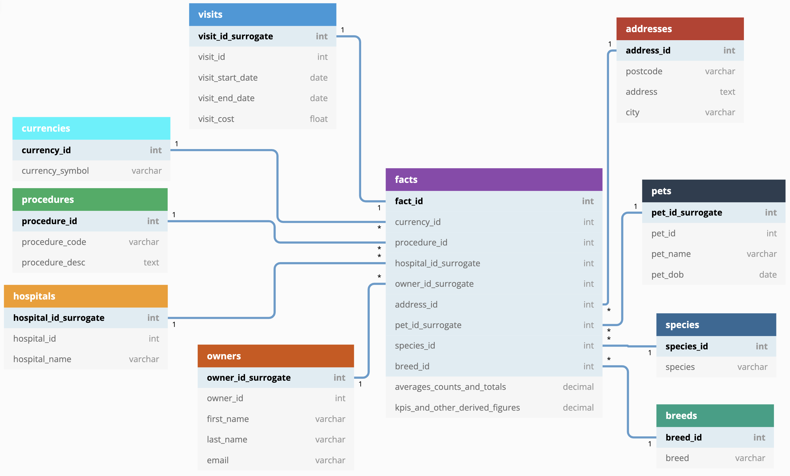

# Vet Hospital Visits for Pets

## 1. Introduction

This is a python project with an ETL pipeline for vet hospital visits data with an accompanying dimensional model.

## 2. Requirements

To set up in a new python environment run `pip install -r requirements.txt`. 
Add new package names to requirements.in, make sure pip-tools is installed (`pip install pip-tools`)  and run `pip-compile requirements.in` to set a specific package version of any new requirements.

## 3. ETL (Extract, Transformation, and Loading) Pipeline

## 4. Dimensional Modelling

### 4.1 Business Process

Assumption that the model is being built for Senior Management to get a holistic view of vet hospital visits and procedures carried out.

### 4.2 Grain

An individual pet hospital visit, billed in a specified currency with a visit cost equal to the total cost of all procedures carried out at that visit, for an owners pet of a given species and breed.

### 4.3 Dimensions and facts

These are outlined in the next section diagram.

## 5. ERD (Entity Relationship Diagram)

## 6. Stakeholder Q's

    1. Ask about what sort of analysis is required to establish the facts  e.g. averages, counts, total, KPIs and other derived figures
    2. Procedure list including cost - fixed per currency or not?
    3. Hospital List
    4. What currencies are visits currently billed in? 
    5. Are exchange rates required / available to show global revenue?
    6. Interest in owner geolocations?

## 7. Other Assumptions

    1. The grain is at the visit level since no procedure costs are provided although ideally you would design at the procedure level if this information was available
    2. The procedures and costs of scheduled future visits (e.g. those in the data in 2022) are fixed so they don't need to be treated differently to prior visits
